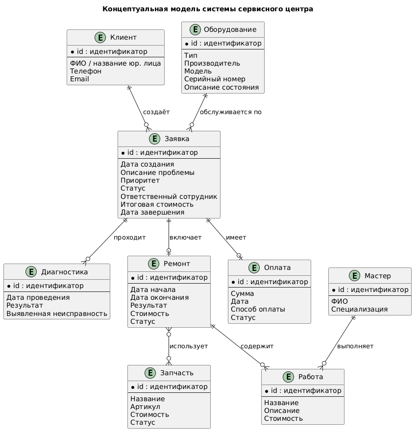
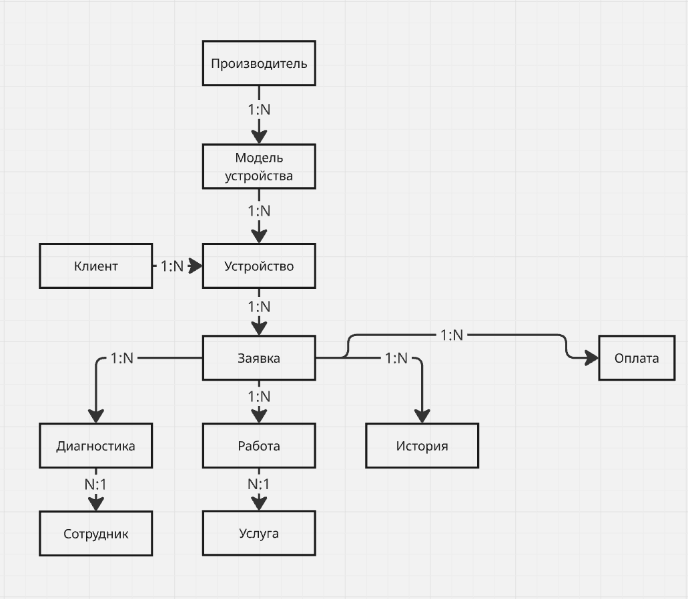

# Система сервисного центра и заявок

## Назначение системы, её границы и ожидаемая польза

### Назначение системы

* Система сервисного центра и обработки заявок предназначена для автоматизации процессов приёма, регистрации, обработки и контроля заявок клиентов на ремонт или тех. обслуживание оборудования.

* Система должна обеспечивать единое информационное пространство для клиентов, сотрудников сервисного центра и руководителей. С её помощью можно регистрировать обращения клиентов, назначать ответственных сотрудников, фиксировать результаты диагностики и ремонта, отслеживать состояние заявок и информировать клиента о ходе выполнения работ.

* Основная бизнес-задача системы — сократить время обработки заявок и снизить количество ошибок при ведении учёта заказов, предоставив сотрудникам структурированный инструмент для управления ремонтами.

### Границы системы

#### В систему входят:

* регистрация и хранение информации о клиентах;
* создание заявок на ремонт или обслуживание;
* описание неисправности и принятого оборудования;
* назначение исполнителя;
* изменение статуса заявки;
* проведение и фиксация результатов диагностики;
* формирование перечня необходимых работ;
* учёт использованных запчастей;
* фиксация результатов ремонта;
* расчёт стоимости выполненных работ;
* уведомление клиента об изменении состояния заявки;
* просмотр истории обслуживания;
* формирование отчётности для сотрудников и руководства.

#### За пределами системы остаются:

* физическая диагностика и ремонт оборудования;
* производство или поставка запчастей;
* бухгалтерский и налоговый учёт сервисного центра;
* управление заработной платой сотрудников;
* фактическая доставка оборудования;
* непосредственная работа с банковскими системами.

При этом система может хранить информацию об оплате, например стоимость ремонта и факт его оплаты, но не обязана самостоятельно выполнять банковскую транзакцию.

#### Пользователи системы
| Пользователь | Основные задачи|
| :---: | :---: |
|Клиент	| Создание заявки, просмотр её статуса, получение информации о ремонте |
| Администратор / оператор | Приём клиентов, регистрация оборудования и заявок, изменение данных |
| Мастер / инженер | Диагностика, выполнение ремонта, указание использованных запчастей |
|Руководитель |	Контроль заявок, просмотр статистики и отчётности |

### Ожидаемая польза

#### Внедрение системы позволит:

* сократить время регистрации и обработки заявок;
* уменьшить количество ошибок при ведении учёта;
* исключить потерю информации о ремонтах;
* обеспечить прозрачность текущего состояния каждой заявки;
* упростить взаимодействие между оператором и мастером;
* предоставить клиенту актуальную информацию о состоянии ремонта;
* получить историю обслуживания оборудования;
* предоставить руководителю статистику работы сервисного центра.

## Основные бизнес-сценарии

В качестве основных сценариев системы выделим:

1. создание заявки на ремонт;
2. приём оборудования и назначение мастера;
3. проведение диагностики;
4. согласование ремонта с клиентом;
5. выполнение и завершение ремонта;
6. выдача оборудования и закрытие заявки;
7. просмотр истории обслуживания и отчётности.

### 1. Создание заявки на ремонт

Участники: Клиент, Администратор / оператор.\
Цель: зарегистрировать обращение клиента и создать новую заявку в системе.

#### Предусловия

* Клиент обратился в сервисный центр.
* Клиент зарегистрирован в системе либо его данные могут быть зарегистрированы оператором.
* Информация об оборудовании известна.

#### Основной ход

Клиент сообщает оператору о необходимости ремонта или самостоятельно создаёт заявку.
Система идентифицирует клиента.
Оператор регистрирует оборудование либо выбирает уже существующее оборудование клиента.
В заявку вносится описание неисправности или причина обращения.
Система создаёт заявку со статусом «Создана».
Клиент получает информацию о зарегистрированной заявке.

#### Альтернативы

* А1. Клиент уже зарегистрирован. Оператор использует существующую карточку клиента.
* А2. Оборудование уже зарегистрировано. Новая карточка оборудования не создаётся.
* А3. Не хватает обязательных данных. Система не позволяет создать заявку до их заполнения.
* А4. Клиент отказывается от обращения. Заявка не создаётся.

#### Результат

Создана новая заявка, связанная с клиентом и оборудованием, со статусом «Создана».

### 2. Приём оборудования и назначение мастера

Участники: Администратор / оператор, Мастер / инженер.\
Цель: принять оборудование в сервисный центр и передать заявку ответственному сотруднику.

#### Предусловия

* Заявка существует и находится в статусе «Создана».
* Оборудование передано в сервисный центр.
* В системе зарегистрирована необходимая информация об оборудовании.

#### Основной ход

Оператор проверяет данные заявки.
Проверяет соответствие принятого оборудования данным в заявке.
Фиксирует факт приёма оборудования.
Система переводит заявку в статус «Принята».
Оператор выбирает подходящего мастера.
Система назначает мастера ответственным за заявку.
Мастер получает информацию о новой заявке.

#### Альтернативы

* А1. Данные оборудования не совпадают с заявкой. Оператор исправляет данные или уточняет информацию у клиента.
* А2. Свободного мастера нет. Заявка остаётся в статусе «Принята» до назначения исполнителя.
* А3. Клиент не передал оборудование. Заявка остаётся в состоянии «Создана».

#### Результат

Оборудование принято в сервисный центр, заявка имеет статус «Принята», а за ней закреплён ответственный мастер.

### 3. Проведение диагностики

Участники: Мастер / инженер.\
Цель: определить неисправность оборудования и необходимые для ремонта работы.

#### Предусловия

* Заявка находится в статусе «Принята».
* Оборудование находится в сервисном центре.
* За заявкой назначен мастер.

#### Основной ход

Мастер открывает заявку и начинает диагностику.
Система переводит заявку в статус «На диагностике».
Мастер проводит диагностику оборудования.
В системе фиксируются обнаруженные неисправности.
Мастер формирует перечень необходимых ремонтных работ.
При необходимости указывает требуемые запчасти.
Рассчитывается предварительная стоимость ремонта.
Система переводит заявку в статус «Ожидает согласования».
Клиент получает уведомление о результатах диагностики и стоимости ремонта.

#### Альтернативы

* А1. Неисправность не обнаружена. Мастер фиксирует результат диагностики и предлагает завершить заявку без ремонта.
* А2. Ремонт технически невозможен. В заявке фиксируется причина невозможности ремонта.
* А3. Необходимых запчастей нет в наличии. Заявка ожидает поступления запчастей.
* А4. Требуется дополнительная диагностика. Мастер продолжает диагностику, не переводя заявку на следующий этап.

#### Результат

Результаты диагностики и перечень необходимых работ сохранены в системе. Заявка ожидает решения клиента.

### 4. Согласование ремонта с клиентом

Участники: Клиент, Мастер / инженер, Администратор / оператор.\
Цель: получить решение клиента о выполнении предложенных ремонтных работ.

#### Предусловия

* Диагностика завершена.
* В заявке указаны неисправность, необходимые работы и их стоимость.
* Заявка находится в статусе «Ожидает согласования».

#### Основной ход

Клиент получает информацию о результатах диагностики.
Клиент просматривает перечень работ и стоимость ремонта.
Клиент подтверждает выполнение ремонта.
Система фиксирует согласие клиента.
Заявка переводится в статус «В ремонте».
Мастер получает подтверждение и приступает к выполнению работ.

#### Альтернативы

* А1. Клиент отказывается от ремонта. Система фиксирует отказ, ремонт переводится в состояние «Отменён», а заявка отменяется.
* А2. Клиент просит изменить состав работ. Мастер корректирует перечень работ и стоимость, после чего заявка повторно ожидает согласования.
* А3. Клиент не отвечает. Заявка остаётся в состоянии «Ожидает согласования».

#### Результат

Ремонт согласован и заявка переходит в состояние «В ремонте», либо клиент отказывается от ремонта.

### 5. Выполнение и завершение ремонта

Участники: Мастер / инженер.\
Цель: выполнить согласованные ремонтные работы и зафиксировать их результаты.

#### Предусловия

* Заявка находится в статусе «В ремонте».
* Клиент согласовал выполнение работ.
* Мастер назначен ответственным за заявку.

#### Основной ход

Мастер начинает выполнение согласованных работ.
Для каждой работы фиксируется её выполнение.
Мастер указывает использованные запчасти.
Система сохраняет сведения о выполненных работах и затраченных материалах.
После выполнения всех работ мастер фиксирует результат ремонта.
Система рассчитывает итоговую стоимость.
Заявка переводится в статус «Готова».
Клиент получает уведомление о завершении ремонта.

#### Альтернативы

* А1. В процессе ремонта обнаружена дополнительная неисправность. Мастер добавляет дополнительные работы, после чего требуется повторное согласование с клиентом.
* А2. Необходимая запчасть отсутствует. Выполнение соответствующей работы приостанавливается.
* А3. Ремонт оказался невозможен. Мастер фиксирует причину, после чего заявка переводится в соответствующее состояние.
* А4. Обнаружена ошибка в выполненной работе. Мастер исправляет её до завершения ремонта.

#### Результат

Все выполненные работы, использованные запчасти и итоговая стоимость сохранены. Оборудование готово к выдаче клиенту.

### 6. Выдача оборудования и закрытие заявки

Участники: Клиент, Администратор / оператор.\
Цель: вернуть отремонтированное оборудование клиенту и завершить заявку.

#### Предусловия

* Заявка находится в статусе «Готова».
* Ремонт завершён.
* Оборудование готово к выдаче.

#### Основной ход

Клиент обращается за получением оборудования.
Оператор идентифицирует клиента и заявку.
Оператор проверяет состояние заявки и итоговую стоимость.
Фиксируется факт оплаты, если оплата предусмотрена процессом.
Оборудование передаётся клиенту.
Система фиксирует дату выдачи.
Заявка переводится в статус «Закрыта».
Информация о ремонте сохраняется в истории обслуживания оборудования.

#### Альтернативы

* А1. Клиент не забрал оборудование. Заявка остаётся в статусе «Готова».
* А2. Оплата не произведена. Выдача оборудования не выполняется, если правила сервисного центра требуют оплаты до выдачи.
* А3. Клиент обнаружил проблему при получении. Оператор регистрирует дополнительное обращение или возвращает оборудование на повторную проверку.

#### Результат

Оборудование возвращено клиенту, заявка переведена в статус «Закрыта», а данные о ремонте доступны в истории обслуживания.

### 7. Просмотр истории обслуживания и отчётности

Участники: Клиент, Администратор / оператор, Руководитель.\
Цель: получить информацию о текущих и завершённых заявках и проанализировать работу сервисного центра.

#### Предусловия

* Пользователь авторизован в системе.
* Для пользователя доступны соответствующие права.

#### Основной ход

Пользователь открывает раздел заявок или истории обслуживания.
Система определяет доступные пользователю данные.
Пользователь задаёт необходимые параметры поиска или фильтрации.
Система отображает соответствующие заявки и информацию о ремонтах.
Руководитель при необходимости формирует отчёт по работе сервисного центра.

#### Альтернативы

* А1. По заданным параметрам ничего не найдено. Система сообщает об отсутствии результатов.
* А2. Клиент запрашивает историю конкретного оборудования. Система отображает предыдущие заявки и ремонты этого оборудования.
* А3. Руководитель формирует отчёт за определённый период. Система рассчитывает статистику по заявкам, срокам ремонта, стоимости и загрузке сотрудников.

#### Результат

Пользователь получает актуальную информацию об обслуживании. Руководитель получает необходимые показатели для контроля работы сервисного центра.

## Концептуальная схема

## Cловарь терминов и концептуальная ER-модель

### 1. Словарь терминов

Система сервисного центра предназначена для регистрации и обработки обращений клиентов по ремонту и техническому обслуживанию устройств.

|Термин|Определение|
|---|---|
|**Клиент**|Лицо, обратившееся в сервисный центр для ремонта или обслуживания устройства.|
|**Устройство**|Техника, принадлежащая клиенту и переданная в сервисный центр для диагностики, ремонта или обслуживания.|
|**Производитель**|Компания, выпустившая устройство.|
|**Модель устройства**|Конкретная модель устройства определённого производителя.|
|**Заявка**|Обращение клиента в сервисный центр, зарегистрированное для выполнения ремонта или обслуживания устройства.|
|**Статус заявки**|Текущее состояние процесса обработки заявки, например «Новая», «На диагностике», «В ремонте», «Готова», «Закрыта».|
|**Приоритет заявки**|Степень срочности обработки заявки.|
|**Описание неисправности**|Информация о проблеме, указанная клиентом при обращении в сервисный центр.|
|**Диагностика**|Процесс определения неисправности, её причины и состояния устройства.|
|**Результат диагностики**|Результат проведённой проверки устройства с указанием выявленных неисправностей и рекомендаций по ремонту.|
|**Сотрудник**|Работник сервисного центра, участвующий в обработке заявок.|
|**Мастер**|Сотрудник, выполняющий диагностику, ремонт и техническое обслуживание устройств.|
|**Услуга**|Вид работы, предоставляемой сервисным центром, например диагностика, замена экрана или чистка устройства.|
|**Работа**|Конкретная работа, выполненная в рамках определённой заявки.|
|**Запчасть**|Компонент или материал, используемый для ремонта устройства.|
|**Использованная запчасть**|Запчасть, фактически использованная при выполнении ремонта по конкретной заявке.|
|**Оплата**|Факт внесения клиентом денежных средств за выполненные работы и использованные запчасти.|
|**История заявки**|Последовательность событий и изменений, произошедших с заявкой в процессе её обработки.|
|**Комментарий**|Дополнительная текстовая информация, относящаяся к заявке, диагностике или выполненной работе.|
|**Уведомление**|Сообщение, информирующее клиента или сотрудника об изменении состояния или другом событии, связанном с заявкой.|
### 2. Основные сущности концептуальной ER-модели

Для построения концептуальной ER-модели выделены следующие основные сущности:

1. **Клиент**
2. **Устройство**
3. **Производитель**
4. **Модель устройства**
5. **Заявка**
6. **Статус заявки**
7. **Приоритет заявки**
8. **Сотрудник**
9. **Диагностика**
10. **Услуга**
11. **Работа**
12. **Запчасть**
13. **Использованная запчасть**
14. **Оплата**
15. **История заявки**
16. **Уведомление**
### Связи между сущностями

| Сущности                              | Кардинальность | Описание связи                                                                                                             |
| ------------------------------------- | -------------- | -------------------------------------------------------------------------------------------------------------------------- |
| **Производитель — Модель устройства** | **1:N**        | Один производитель может выпускать несколько моделей устройств. Каждая модель относится к одному производителю.            |
| **Модель устройства — Устройство**    | **1:N**        | Одна модель может соответствовать нескольким конкретным устройствам. Каждое устройство относится к одной модели.           |
| **Клиент — Устройство**               | **1:N**        | Один клиент может владеть несколькими устройствами. Каждое устройство связано с одним клиентом.                            |
| **Устройство — Заявка**               | **1:N**        | Одно устройство может иметь несколько заявок в течение времени. Каждая заявка относится к одному устройству.               |
| **Заявка — Диагностика**              | **1:N**        | В рамках одной заявки может проводиться одна или несколько диагностик. Каждая диагностика относится к определённой заявке. |
| **Диагностика — Сотрудник**           | **N:1**        | Один сотрудник может выполнять несколько диагностик. Каждая диагностика выполняется одним сотрудником.                     |
| **Заявка — Работа**                   | **1:N**        | Одна заявка может включать несколько выполненных работ. Каждая работа относится к определённой заявке.                     |
| **Работа — Услуга**                   | **N:1**        | Один вид услуги может соответствовать множеству выполненных работ. Каждая выполненная работа относится к одной услуге.     |
| **Заявка — История**                  | **1:N**        | Для одной заявки может существовать множество записей истории, отражающих изменения и события в процессе её обработки.     |
| **Заявка — Оплата**                   | **N:1**        | Согласно представленной модели, несколько заявок связаны с одной оплатой.                                                  |
### Описание концептуальной ER-модели

Концептуальная ER-модель системы сервисного центра и обработки заявок предназначена для представления основных объектов предметной области и связей между ними. Модель описывает процесс обработки устройства клиента от его регистрации в системе до выполнения необходимых работ и оплаты.

Центральной сущностью модели является **«Заявка»**, которая связывает устройство клиента с процессами диагностики, выполнения работ, ведения истории и оплаты. Каждая заявка относится к определённому устройству и содержит информацию, необходимую для организации его обслуживания или ремонта.

Сущность **«Клиент»** представляет лицо, обращающееся в сервисный центр. Один клиент может иметь несколько устройств. Каждое устройство характеризуется определённой моделью, которая, в свою очередь, относится к конкретному производителю.

Сущность **«Устройство»** представляет конкретную технику клиента, переданную на обслуживание. Одно устройство может иметь несколько заявок, если клиент обращается в сервисный центр повторно.

В рамках заявки может проводиться **«Диагностика»**, выполняемая сотрудником сервисного центра. Также заявка может включать несколько **«Работ»**, каждая из которых относится к определённой **«Услуге»**.

Для каждой заявки формируется **«История»**, позволяющая фиксировать события и изменения, связанные с процессом её обработки. Также заявка связана с сущностью **«Оплата»**, отражающей факт оплаты услуг сервисного центра.

Таким образом, модель отражает основные процессы предметной области: регистрацию клиентов и их устройств, создание заявок, проведение диагностики, выполнение работ, фиксацию истории обработки и осуществление оплаты.

## Жизненный цикл основых сущностей

В качестве трёх основных сущностей удобно выбрать:

* Заявка
* Оборудование
* Ремонт

При этом именно заявка является центральной сущностью системы, а оборудование и ремонт связаны с ней.

### Жизненный цикл заявки

#### Заявка проходит следующий жизненный цикл:

Создана → Принята → На диагностике → Ожидает согласования → В ремонте → Готова → Закрыта

#### Также возможны альтернативные состояния:

Отменена — если клиент отказался от ремонта или заявка была создана ошибочно.

#### Описание состояний
| Состояние	| Описание |
| :---: | :---: |
|Создана | Клиент или оператор зарегистрировал обращение |
| Принята	| Оператор проверил данные и принял оборудование в сервисный центр |
| На диагностике |	Мастер определяет причину неисправности |
| Ожидает согласования |	Определены необходимые работы и стоимость, ожидается решение клиента |
| В ремонте	| Клиент согласовал ремонт, мастер выполняет работы |
|Готова |	Ремонт завершён, оборудование готово к выдаче |
| Закрыта |	Оборудование выдано клиенту, заявка завершена |
| Отменена |	Обработка заявки прекращена |

### Жизненный цикл оборудования

Оборудование — конкретное устройство клиента, которое поступает в сервисный центр.

#### Его жизненный цикл можно представить следующим образом:

Зарегистрировано → Принято в сервис → На диагностике → На ремонте → Готово к выдаче → Выдано

#### Состояния
|Состояние | Описание |
| :---: | :---: |
| Зарегистрировано |	Информация об устройстве внесена в систему |
| Принято в сервис |	Устройство физически передано сервисному центру |
| На диагностике |	Мастер проводит диагностику |
| На ремонте |	Выполняются ремонтные работы |
| Готово к выдаче |	Работы завершены |
| Выдано |	Устройство возвращено клиенту |

После выдачи оборудование не удаляется из системы. Оно остаётся в базе как объект истории обслуживания. При следующем обращении для него может быть создана новая заявка.

Это позволяет хранить историю ремонтов конкретного устройства.

### Жизненный цикл ремонта

Ремонт появляется после того, как в результате диагностики определены неисправность и необходимые работы.

#### Его жизненный цикл:

Запланирован → Согласован → Выполняется → Завершён

#### При отказе клиента:

Запланирован → Отменён

#### Состояния
| Состояние	| Описание |
| :---: | :---: |
| Запланирован |	Мастер определил необходимые работы |
| Согласован |	Клиент подтвердил выполнение ремонта |
| Выполняется |	Мастер выполняет ремонт |
| Завершён |	Все запланированные работы выполнены |
| Отменён |	Клиент отказался от ремонта либо ремонт невозможно выполнить |

При этом ремонт может состоять из нескольких работ и для каждой работы можно хранить исполнителя, стоимость, время выполнения и результат.

## Реестр рисков и допущений

### 1. Реестр рисков

**Риск** — потенциальное событие или обстоятельство, которое может негативно повлиять на разработку или работу системы.

|№|Риск|Вероятность|Влияние|Меры предотвращения / реагирования|
|---|---|---|---|---|
|**R1**|Несогласованность требований между участниками команды|Средняя|Высокое|Зафиксировать требования и бизнес-правила в едином документе, согласовывать изменения командой.|
|**R2**|Неправильное распределение данных между PostgreSQL, MongoDB и Redis|Средняя|Высокое|До реализации определить назначение каждого хранилища и обосновать выбор технологии для каждого типа данных.|
|**R3**|Ошибки в проектировании структуры данных и связей между сущностями|Средняя|Высокое|Провести проверку концептуальной и логической моделей до начала реализации БД.|
|**R4**|Потеря или повреждение данных|Низкая|Высокое|Предусмотреть резервное копирование и восстановление данных, использовать транзакции для критических операций.|
|**R5**|Несогласованность данных между компонентами системы|Средняя|Высокое|Определить источник достоверных данных и правила синхронизации между хранилищами.|
|**R6**|Ошибки при разработке HTTP API|Средняя|Среднее|Использовать единый формат запросов и ответов, документировать API и проводить тестирование эндпоинтов.|
|**R7**|Недостаточная производительность системы при большом количестве запросов|Низкая|Среднее|Использовать Redis для кэширования часто запрашиваемых данных, оптимизировать запросы к основному хранилищу.|
|**R8**|Ошибки при реализации бизнес-логики обработки заявок|Средняя|Высокое|Описать жизненный цикл заявки и допустимые переходы между статусами, покрыть основные сценарии тестами.|
|**R9**|Нарушение прав доступа к данным клиентов|Низкая|Высокое|Реализовать аутентификацию и разграничение доступа пользователей в соответствии с их ролями.|
|**R10**|Задержка разработки отдельных компонентов из-за зависимости задач между участниками|Средняя|Среднее|Разделить проект на независимые задачи, определить интерфейсы взаимодействия между компонентами и использовать систему контроля версий.|
|**R11**|Недостаточное время на тестирование и исправление ошибок|Средняя|Высокое|Планировать тестирование параллельно с разработкой, а не только перед сдачей проекта.|
|**R12**|Изменение требований к проекту в процессе разработки|Средняя|Среднее|Фиксировать изменения требований и оценивать их влияние на уже реализованные компоненты.|
|**R13**|Сбой одного из компонентов инфраструктуры|Низкая|Высокое|Предусмотреть корректную обработку ошибок подключения и восстановление соединений.|
|**R14**|Потеря изменений или возникновение конфликтов при совместной разработке|Средняя|Среднее|Использовать Git, отдельные ветки для задач и регулярную синхронизацию изменений.|

---

### 2. Реестр допущений

**Допущение** — условие, которое принимается как верное при проектировании системы, хотя оно может быть не подтверждено на момент разработки.

| №       | Допущение                                                                                                                                                                       |
| ------- | ------------------------------------------------------------------------------------------------------------------------------------------------------------------------------- |
| **A1**  | Пользователи системы имеют доступ к интернету или локальной сети, в которой размещено приложение.                                                                               |
| **A2**  | Каждый клиент может быть однозначно идентифицирован в системе.                                                                                                                  |
| **A3**  | Каждое устройство связано с одним клиентом.                                                                                                                                     |
| **A4**  | Каждое устройство имеет определённую модель, а каждая модель относится к определённому производителю.                                                                           |
| **A5**  | Для одного устройства может существовать несколько заявок, если клиент обращается в сервисный центр повторно.                                                                   |
| **A6**  | Каждая заявка относится к одному конкретному устройству.                                                                                                                        |
| **A7**  | Заявка проходит определённый жизненный цикл и имеет статус, характеризующий её текущее состояние.                                                                               |
| **A8**  | В рамках одной заявки может выполняться одна или несколько диагностик.                                                                                                          |
| **A9**  | Диагностика выполняется сотрудником сервисного центра.                                                                                                                          |
| **A10** | В рамках одной заявки может выполняться несколько работ.                                                                                                                        |
| **A11** | Каждая выполненная работа соответствует определённому виду услуги.                                                                                                              |
| **A12** | При выполнении работ могут использоваться запчасти.                                                                                                                             |
| **A13** | Оплата связана с заявкой и отражает факт оплаты клиентом выполненных работ и использованных материалов.                                                                         |
| **A14** | История заявки содержит информацию об основных событиях и изменениях, происходящих с заявкой.                                                                                   |
| **A15** | Сотрудники сервисного центра имеют различные полномочия в зависимости от выполняемых ими функций.                                                                               |
| **A16** | Данные о клиентах, устройствах и заявках должны сохраняться между сеансами работы пользователя.                                                                                 |
| **A17** | Технические результаты диагностики могут иметь различный набор параметров в зависимости от типа устройства.                                                                     |
| **A18** | Уведомления формируются системой при наступлении определённых событий, связанных с обработкой заявки.                                                                           |
| **A19** | Система предназначена для учебного проекта и не предполагает интеграцию с реальными платёжными системами и внешними сервисами, если это отдельно не предусмотрено требованиями. |
| **A20** | Пользователь системы обладает необходимыми правами для выполнения доступных ему операций.                                                                                       |

## Бизнес-правила и критерии приёмки

1. **Уникальный номер заявки.** Каждой заявке при создании присваивается уникальный номер, который нельзя изменить вручную.
   *Критерий приёмки:* при создании двух заявок номера не совпадают, попытка изменить номер через API отклоняется.

2. **Обязательные поля при создании заявки.** Заявка создаётся только при наличии клиента, устройства и описания неисправности.
   *Критерий приёмки:* запрос без одного из этих полей возвращает ошибку с указанием, какое поле отсутствует.

3. **Заявка движется по фиксированным статусам.** Разрешены только переходы `Создана → Принята → На диагностике → Ожидает согласования → В ремонте → Готова → Закрыта`. Отмена возможна из любого статуса, кроме `Закрыта`.
   *Критерий приёмки:* попытка перехода в обход цепочки, например из `Создана` сразу в `Готова`, отклоняется, и статус заявки в базе не меняется.

4. **Приём устройства и переход в статус «Принята» требуют подтверждения оператора.** Заявка переходит в статус `Принята` только после того, как оператор зафиксировал факт получения устройства в сервисном центре.
   *Критерий приёмки:* попытка перевести заявку в статус `Принята` без отметки о приёме устройства возвращает ошибку.

5. **Диагностику и ремонт по одной заявке ведёт один и тот же мастер**, и в любой момент за заявкой закреплён не более одного активного мастера. Заявка переходит в статус `На диагностике` только после назначения ответственного мастера, и тот же мастер остаётся ответственным на этапе ремонта.
   *Критерий приёмки:* попытка сменить статус без назначенного мастера возвращает ошибку; попытка назначить на ремонт другого мастера, чем на диагностику, отклоняется без отдельного действия по переназначению; при переназначении предыдущий мастер автоматически снимается со всех этапов заявки, история переназначений сохраняется с датой и временем.

6. **Переход в статус «Ожидает согласования» возможен только при заполненных результатах диагностики.** Заявка переходит в этот статус только после того, как мастер зафиксировал результат диагностики, перечень необходимых работ и предварительную стоимость.
   *Критерий приёмки:* попытка перевести заявку в этот статус без указанной стоимости и перечня работ отклоняется.

7. **Ремонт начинается только после подтверждения клиента.** Прежде чем перевести заявку в статус `В ремонте`, необходимо зафиксировать согласие клиента на выполнение работ по указанной стоимости.
   *Критерий приёмки:* переход заявки в статус `В ремонте` невозможен без зафиксированного согласия клиента, дата и способ подтверждения сохраняются в заявке.

8. **Запчасть нельзя зарезервировать дважды.** Одна единица запчасти может быть закреплена не более чем за одной заявкой одновременно.
   *Критерий приёмки:* повторная попытка закрепить уже занятую запчасть за другой заявкой отклоняется, остаток на складе не уходит в отрицательное значение.

9. **Запчасть списывается только при завершении ремонта.** Списание запчасти со склада как использованной происходит строго при переходе заявки в статус `Готова`.
   *Критерий приёмки:* запись об использованной запчасти создаётся только вместе с переходом заявки в статус `Готова`, что проверяется по временной метке.

10. **Отмена ремонта не всегда означает отмену всей заявки.** Если ремонт отменяется из-за невозможности выполнить работы, например при отсутствии нужной запчасти, статус ремонта переводится в `Отменён`, а заявка может остаться открытой для повторного согласования или последующей отмены самим клиентом.
    *Критерий приёмки:* статус ремонта и статус заявки хранятся раздельно, отмена ремонта не приводит автоматически к отмене заявки без отдельного действия.

11. **Отмена заявки клиентом возможна только до перехода в статус «В ремонте».** После начала ремонта отмена требует дополнительного согласования с сервисным центром.
    *Критерий приёмки:* попытка отмены заявки в статусе `В ремонте` или позже требует дополнительного подтверждения оператора и не выполняется автоматически.

12. **Заявка закрывается только после подтверждения оплаты и выдачи устройства.** Заявка переходит в статус `Закрыта` только после того, как зафиксирован факт единой оплаты на полную итоговую стоимость и факт выдачи устройства.
    *Критерий приёмки:* переход в статус `Закрыта` отклоняется, если оплата не зафиксирована или её сумма не равна итоговой стоимости заявки, либо не зафиксирован факт выдачи устройства.

13. **Повторный ремонт того же дефекта в течение гарантийного периода не тарифицируется.** Если по тому же устройству и той же неисправности заявка открыта повторно в течение 30 дней после закрытия предыдущей, новая заявка помечается как гарантийный случай.
    *Критерий приёмки:* система находит связанную закрытую заявку по устройству и категории неисправности и проставляет флаг гарантийного случая с нулевой стоимостью работ.

14. **Изменение описания неисправности после диагностики фиксируется в истории заявки.** Если в процессе диагностики выясняется, что реальная проблема отличается от заявленной клиентом, изменения вносит только назначенный мастер, а предыдущая версия сохраняется.
    *Критерий приёмки:* в истории заявки видно исходное и изменённое описание неисправности, а также кто и когда внёс правку.

15. **Клиент получает уведомление при каждой смене статуса заявки, влияющей на него.** При переходе заявки в статусы `Принята`, `Ожидает согласования`, `Готова` и `Закрыта` создаётся уведомление для клиента.
    *Критерий приёмки:* при каждом из перечисленных переходов статуса в системе появляется новая запись уведомления, связанная с этой заявкой и этим клиентом.

16. **Приоритет заявки влияет на порядок диагностики.** Заявки с более высоким приоритетом отображаются выше в очереди на диагностику.
    *Критерий приёмки:* при запросе списка заявок, ожидающих диагностики, заявки с высоким приоритетом идут раньше заявок с обычным приоритетом при прочих равных условиях.